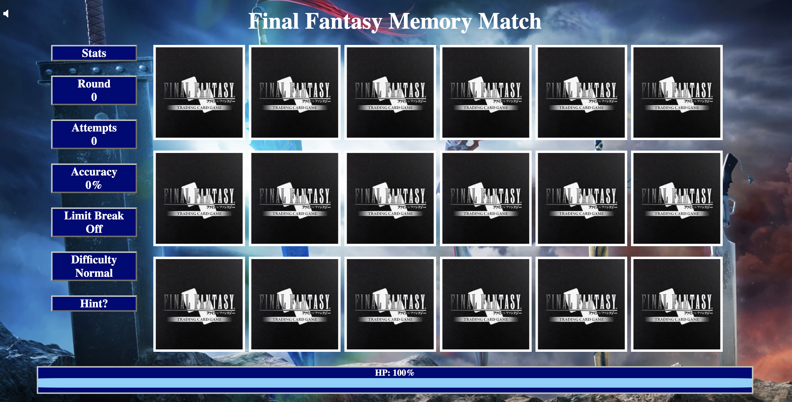

# Memory Match

> - Maintained by: `John Ko`

### Description
Final Fantasy themed memory match game where the player must match all the cards before running out of health.

https://memory-match.johnkode.com/

### Technologies Used
* HTML5
* CSS3
* JavaScript ES5

### Screenshoot

### Features
1. User can match cards
1. User can view their statistics on the game played
1. User can play again when the game is finished
1. Mobile responsive in iPhone6/7/8 and iPad

### Bonus Feature / Challenge
- Shuffling cards
- Dynamically creating cards
